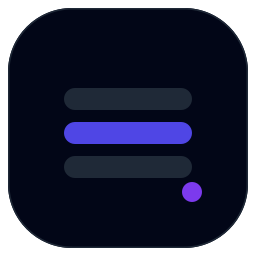
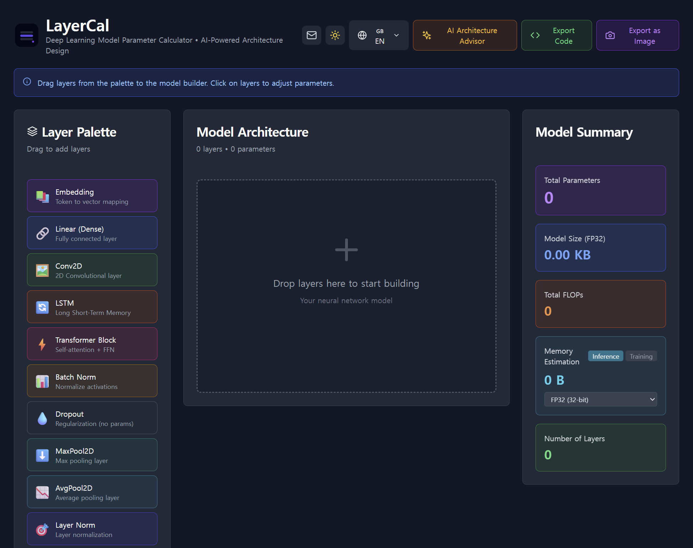

<p align="center">
  
</p>

<h1 align="center">LayerCal</h1>

<p align="center">
  <a href="https://github.com/chanjoongx/layercal/actions/workflows/test.yml">
    
  </a>
</p>

<p align="center">
  Browser-based deep learning parameter calculator with AI Architecture Advisor.<br/>
  Drag layers, get instant parameter counts, FLOPs, memory estimates, and framework code — or describe your model in natural language and let AI generate the architecture.
</p>

<p align="center">
  <a href="https://layercal.com"></a>
</p>

<p align="center">
  
  
  
  
  
  
  
  
  
</p>

<br/>

<p align="center">
  
</p>

---

## Features

Build a neural network by dragging layers onto a canvas. Everything runs client-side — no backend, no signup.

| | |
|---|---|
| **14 Layer Types** | Embedding · Linear · Conv2D · LSTM · GRU · Transformer · Attention · BatchNorm · LayerNorm · Dropout · MaxPool2D · AvgPool2D · ReLU · Softmax |
| **Real-time Computation** | Parameter counts, FLOPs (forward pass), memory estimation with FP32 / FP16 / INT8 precision across inference and training modes |
| **Code Generation** | PyTorch `nn.Module` · TensorFlow Sequential / Functional API · JAX/Flax `nn.compact` — with smart layer grouping and context-aware naming |
| **AI Architecture Advisor** | Describe what you need in plain English → get a complete layer stack generated by LLM, validated and applied to canvas |
| **Multi-language** | EN · KO · JA · ZH · ES · FR · DE · PT |
| **Dark Mode** | System preference detection + manual toggle |

## AI Architecture Advisor

Describe your model requirements in natural language — the advisor generates a validated architecture and applies it directly to the canvas.

**How it works:**

1. Your query is matched against a knowledge base of 12 reference architectures (LeNet, VGG, MobileNet, BERT, GPT, etc.)
2. Relevant references are injected into the LLM prompt via a lightweight RAG pipeline
3. The LLM generates a JSON layer stack
4. A post-processing pass validates every layer, snaps parameters to legal values, and fixes cross-layer dimension mismatches automatically
5. The result is applied to the canvas with one click

**Supported providers** (BYOK — bring your own API key):

| Provider | Model | Free Tier |
|----------|-------|-----------|
| Google Gemini | gemini-2.5-flash-lite | 1,000 req/day |
| OpenAI | gpt-4o-mini | Requires billing |
| Anthropic Claude | claude-3-5-haiku | Requires billing |

API keys are stored in your browser's localStorage and never leave your device except to call the provider's API directly.

## Getting Started

```bash
git clone https://github.com/chanjoongx/layercal.git
cd layercal
npm install
npm run dev
```

## Testing

```bash
npm test            # run all tests
npm run test:watch  # watch mode during development
```

Two test suites covering 85 cases: layer type calculations (parameter counts, FLOPs, memory for all 14 types with edge cases like bidirectional LSTM stacking and bias toggle) and RAG pipeline validation (JSON extraction from various LLM output formats, parameter snapping, cross-layer dimension fixing).

## Project Structure

```
src/
├── components/
│   ├── LayerCal.jsx            # Main app — UI, state, drag-drop
│   ├── AIAdvisor.jsx           # AI Advisor modal — provider selection, query input
│   └── ui/                     # shadcn/ui primitives
├── config/
│   ├── layerTypes.js           # Layer definitions + calculation formulas
│   ├── translations.js         # i18n for 8 languages
│   └── architectureKB.js       # 12 reference architectures for RAG retrieval
└── utils/
    ├── llmClient.js            # Unified LLM client (OpenAI, Gemini, Claude)
    ├── ragPipeline.js          # Retrieval → prompt building → parsing → validation
    ├── codeGenerator.js        # PyTorch / TensorFlow / JAX codegen
    ├── imageExport.js          # PNG export via html2canvas
    └── localStorage.js         # Safe storage + system detection
└── __tests__/
    ├── layerTypes.test.js      # 44 tests: params, FLOPs, memory
    └── ragPipeline.test.js     # 41 tests: parsing, snapping, cross-layer
```

## Calculation Reference

### Parameter Formulas

| Layer | Formula | Notes |
|-------|---------|-------|
| Embedding | `V × E` | V = vocab, E = dim |
| Linear | `I × O + O` | with bias |
| Conv2D | `Cin × Cout × K² + Cout` | with bias |
| LSTM | `4(IH + H² + 2H) × L × dir` | per-layer input adjustment |
| GRU | `3(IH + H² + 2H) × L × dir` | 3 gates |
| Transformer | `12d² + 13d` | per block, d_ff = 4d |
| Attention | `4(d² + d)` | Q, K, V, O projections |
| BatchNorm | `2F` | γ + β |

### Memory Estimation

| Mode | Formula |
|------|---------|
| Inference | `params × bytes_per_param` |
| Training (Adam) | `params × bytes_per_param × 4` |

FP32 = 4 bytes, FP16 = 2 bytes, INT8 = 1 byte

### Code Generation

Not simple template substitution — the generator handles:

- **Grouping**: 3× consecutive Transformer → `TransformerEncoder(num_layers=3)`
- **Context**: Auto-selects `BatchNorm1d` / `BatchNorm2d` from preceding layer
- **Naming**: `self.embed`, `self.fc1`, `self.conv` instead of `self.layer_0`

## Tech Stack

React 18 · Vite 5 · Tailwind CSS 3.4 · shadcn/ui · Vitest · html2canvas · Cloudflare Pages

## Documentation

- [Technical Guide](docs/LayerCal-Guide.pdf) — Detailed formulas, code generation examples, and architecture overview

## License

[MIT](LICENSE)

---

<p align="center">
  Built by <a href="https://github.com/chanjoongx">@chanjoongx</a>
</p>
