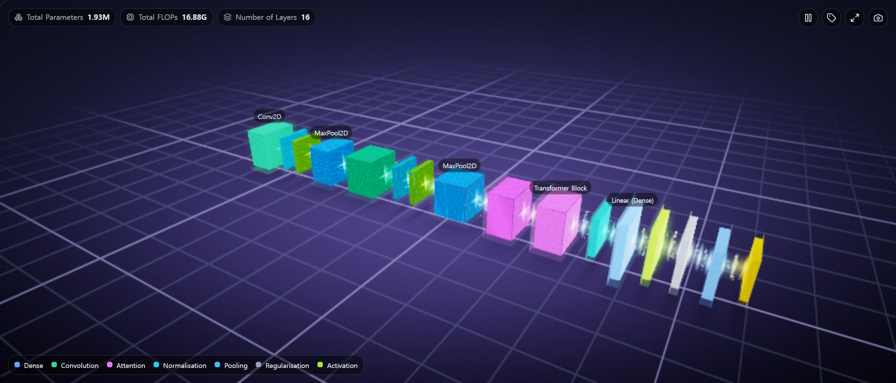
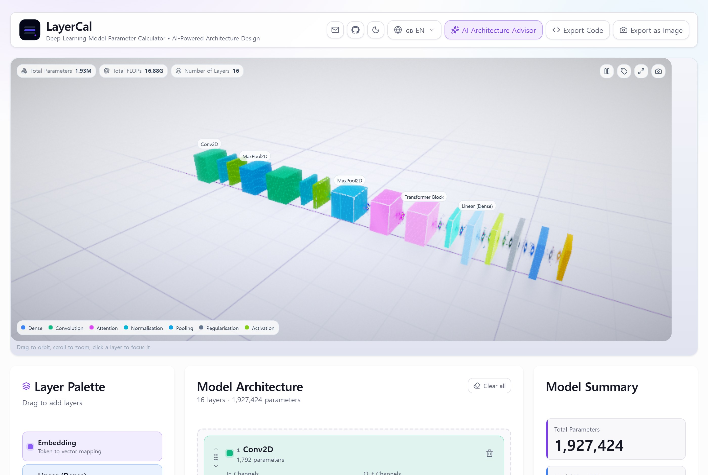
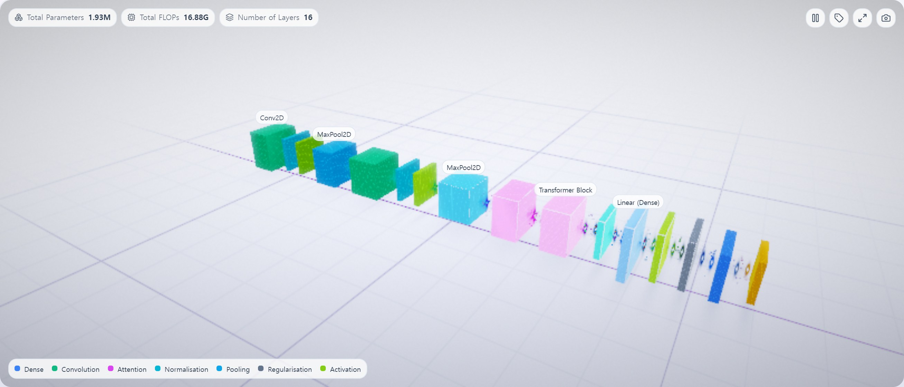
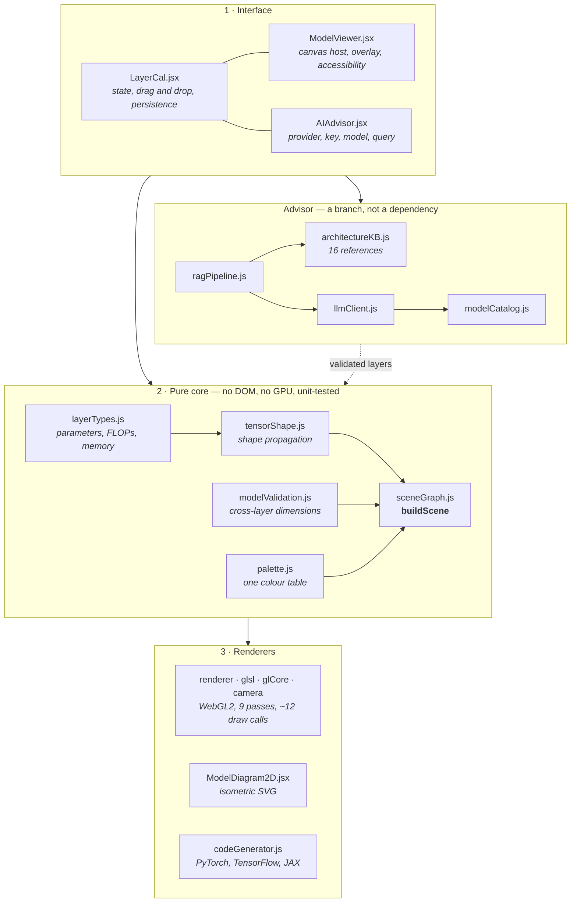
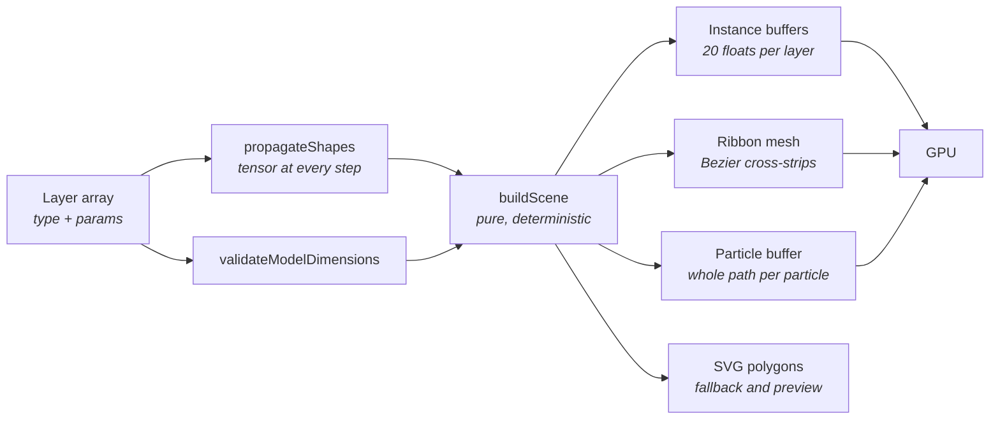
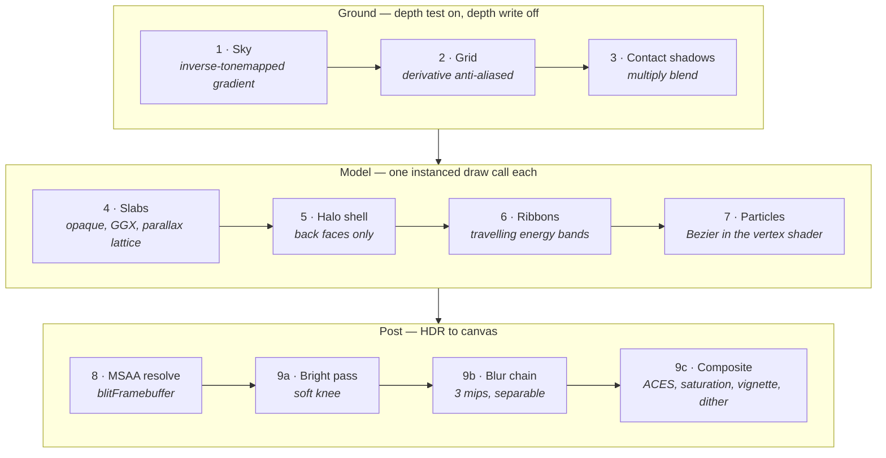
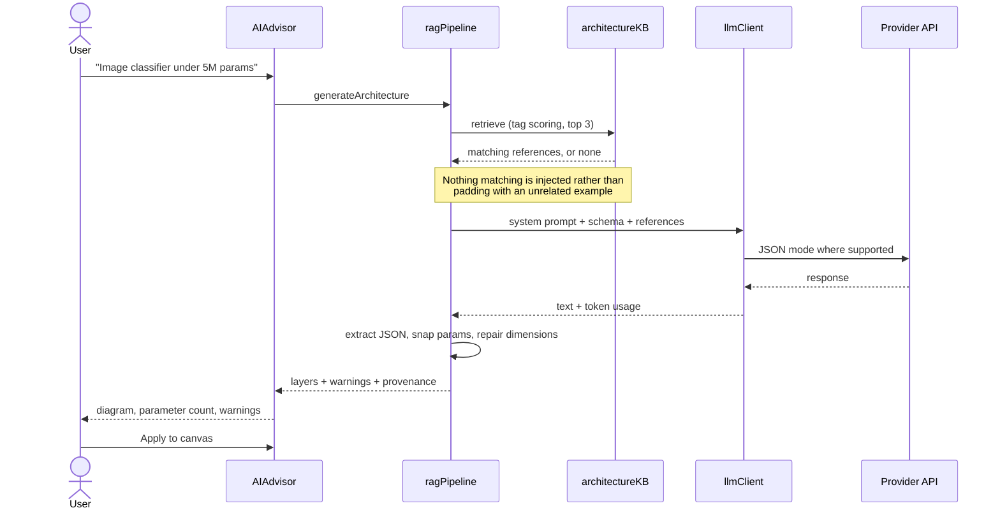

<p align="center">
  
</p>

<h1 align="center">LayerCal</h1>

<p align="center">
  <a href="https://github.com/chanjoongx/layercal/actions/workflows/test.yml">
    
  </a>
</p>

<p align="center">
  Build a neural network in the browser and watch a forward pass run through it.<br/>
  Parameter counts, FLOPs, memory, runnable framework code — and a real-time 3D view of the tensors.
</p>

<p align="center">
  <a href="https://layercal.com"></a>
</p>

<p align="center">
  
  
  
  
  
  
  
  
  
  
</p>

<br/>

<p align="center">
  
</p>

---

## What it does

Drag layers onto a canvas and the parameter count, FLOPs and memory footprint update as you type.
Above the canvas, the same model is drawn as a stack of tensor volumes with a pulse of light
travelling through it — a forward pass, on a loop. When the model looks right, export it as PyTorch,
TensorFlow or JAX code that actually runs.

Everything happens in the browser. There is no backend, no account, and nothing is uploaded.

| | |
|---|---|
| **Live 3D architecture** | Tensor volumes sized by shape, lit by parameter share, connected by animated data flow. WebGL2, written from scratch, no 3D library |
| **14 layer types** | Embedding, Linear, Conv2D, LSTM, GRU, Transformer, Attention, BatchNorm, LayerNorm, Dropout, MaxPool2D, AvgPool2D, ReLU, Softmax |
| **Live computation** | Parameter counts, forward-pass FLOPs, and memory across FP32, FP16, BF16 and INT8 for both inference and Adam training |
| **Code generation** | PyTorch `nn.Module`, TensorFlow Sequential and Functional API, JAX/Flax `nn.compact` |
| **AI architecture advisor** | Describe what you need in plain English and get a validated layer stack back |
| **Dimension checking** | Layers whose input does not match the previous layer's output are flagged on the canvas *and* in 3D |
| **Persistent canvas** | Your model is saved locally and restored on the next visit |
| **Eight languages** | EN, KO, JA, ZH, ES, FR, DE, PT |
| **Dark mode** | Follows the system setting, with a manual override. The 3D view re-lights itself to match |

<p align="center">
  
</p>

---

## The visualisation

A picture of a network that only shows boxes in a row tells you the layer order, which you already
knew. This one encodes the numbers:

| Visual property | What it means |
|-----------------|---------------|
| **Volume size** | The shape of the tensor the layer emits. A Conv2D is `channels × H × W`; a Linear is a thin plate as wide as its output. Sizes are log-compressed, because a 50,000-word embedding beside a 64-unit dense layer is a 780× ratio and one of them would be invisible |
| **Resting brightness** | The layer's share of total parameters. The layers that dominate your model's size are the ones that glow |
| **Travelling pulse** | A forward pass. A Gaussian wave of activation sweeps input to output once every ~3.6 seconds, lighting each volume as it arrives |
| **Flow density and speed** | The layer's share of total FLOPs. Compute-heavy links carry more, faster particles |
| **Ribbon width** | The feature dimension entering and leaving. A 64→512 expansion visibly flares |
| **Internal lattice** | Channel count. A 512-channel layer has visibly finer internal structure than a 16-channel one |
| **Amber stripes, dashed link** | A dimension mismatch: this layer's declared input does not match what the previous layer emits, so the exported code would not run |
| **Thin plates riding above the flow** | Activations, dropout and normalisation — they annotate the tensor rather than reshaping it |

Drag to orbit, scroll to zoom, click a layer to fly to it (which also scrolls its card into view).
Leave it alone for four seconds and the camera drifts on its own.

<p align="center">
  
</p>

---

## Architecture

Two independent halves that meet at one pure function. Everything below `buildScene` is geometry
and pixels; everything above it is a neural network. Neither knows about the other.



The renderer is behind a **dynamic import**, not a static one and not `React.lazy`: the test suite
server-renders every component with `react-dom/server`, which cannot suspend, and an effect never
runs there at all. Until the module resolves — and permanently, if the browser has no WebGL2 — the
isometric SVG stands in, so the panel is never blank and the layout never shifts.

### From model state to pixels



`buildScene` is pure: same layers in, deep-equal scene out, no clock, no randomness, no DOM. Every
moving thing is a shader uniform rather than data baked into the scene, which is why a
visualisation this animated can be unit-tested without a GPU — and why a 60-layer model costs the
same to draw as a 3-layer one.

---

## The render pipeline

Nine passes, about a dozen draw calls, **independent of layer count**. Every per-layer thing is
instanced; every per-frame motion is a uniform.



Things that are load-bearing rather than decorative:

- **Framing fits the bounding box, not the bounding sphere.** A 16-layer stack is a long, thin box.
  Fitting its sphere into the vertical field of view backs the camera off far enough to render the
  model as a smudge. The camera projects the box's half-extents onto its own right/up/forward axes
  and fits those, so the framing is tight at any orbit angle.
- **The clear colour is solved backwards through the tone map.** The composite pass tone-maps
  everything, so clearing to the panel's background colour would come out visibly lighter than the
  CSS around it. Inverting the ACES fit gives the linear value that tone-maps *to* the colour we
  want.
- **Saturation is restored after tone mapping.** ACES desaturates as it rolls off, which is right
  for photography and wrong for a diagram whose colours carry meaning.
- **Camera smoothing is frame-rate independent.** `target + (current - target) * exp(-λ dt)`, not a
  fixed per-frame lerp — otherwise the same camera feels heavy at 60 Hz and twitchy at 144 Hz.
- **Blending switches with the theme.** Additive light on a near-white ground clips to white and
  loses the hue that carries the meaning, so the light theme composites the flow *over* instead,
  in the layers' body colours rather than their glow colours.
- **Adaptive quality, and a cheaper start on software rasterisers.** A software renderer is
  fill-rate bound, so it starts at the lowest quality level and renders below native resolution.
  Measured under SwiftShader with no GPU at all, a 5-layer model and a 60-layer model measure the
  same frame rate as each other, run after run — the design goal, confirmed.
- **Reduced quality thins the flow, it does not truncate it.** Particles are written into their
  buffer round-robin across links rather than link by link, because lower quality levels draw a
  prefix of that buffer. A link-major layout would delete the flow from the tail of the model
  instead of thinning it evenly; the ordering is a pure function with its own unit tests.
- **Context loss is handled, properly.** Programs, vertex arrays and static buffers die with the
  context, not just the render targets, so recovery is not attempted in place: both events are
  reported to React, which drops back to the SVG and then rebuilds the engine through exactly the
  code that runs at mount. A tool that turns into a black rectangle when the OS suspends the GPU is
  worse than one that never had 3D.

### Why no three.js

three.js would cost roughly 150 KB gzipped for a feature that needs perhaps 6% of its surface, and
would put a third-party render loop between the user's model and the screen.

The renderer here is about 2,500 lines of WebGL2 across four files in `src/viz/` — the engine, the
shaders, the GL plumbing and the camera — sitting on roughly 850 lines of framework-free geometry
and maths that are covered by **140 unit tests** and never touch a GPU. It ships in its own
lazily-loaded chunk (**17.7 KB gzipped**) that is not fetched if the panel is never shown.

Measured against a build of the previous commit, the whole release adds **11.2 KB gzipped** to the
initial payload — the pure geometry modules, the SVG diagram, the model catalogue, four more
reference architectures and eight locales of new strings, less the stylesheet that shrank when
the old per-layer Tailwind colour classes were deleted. **`package.json` gained no dependency.**

---

## AI architecture advisor

Describe your requirements in natural language. The advisor returns a layer stack, draws it, shows
you its estimated parameter count, and applies it to the canvas once you approve.



1. The query is matched against a knowledge base of **16** reference architectures — LeNet-5, VGG,
   MobileNet, BERT, GPT, ViT, ConvNeXt, a Llama-style decoder, a Whisper-style audio encoder and more
2. Matching references go into the prompt. If nothing matches, none are injected, because an
   unrelated example steers the model in the wrong direction
3. The model returns a JSON layer stack, using native JSON mode where the provider supports it
4. A deterministic pass validates every layer, snaps parameters to legal values, and repairs
   cross-layer dimension mismatches
5. You see the proposal — drawn, not just listed — and its parameter count before anything touches
   the canvas

### Providers and models

Bring your own API key. Nothing is proxied through a server. Model IDs and prices verified
**2026-09-04**; the picker lives under **Advanced**, and any model ID can still be typed by hand.

| Provider | Model | Tier | $ / 1M in | $ / 1M out |
|----------|-------|------|-----------|------------|
| Google Gemini | `gemini-3.5-flash-lite` **(default)** | fast | free tier | free tier |
| | `gemini-3.1-flash-lite` | fast | free tier | free tier |
| | `gemini-3.6-flash` · `gemini-3.8-flash` | balanced | — | — |
| OpenAI | `gpt-5.6-luna` **(default)** | fast | 0.20 | 1.20 |
| | `gpt-5.6-terra` | balanced | 2.00 | 12.00 |
| | `gpt-5.6-sol` | frontier | 4.00 | 20.00 |
| | `gpt-6-astra` | frontier | 10.00 | 50.00 |
| Anthropic Claude | `claude-haiku-4-5` **(default)** | fast | 1.00 | 5.00 |
| | `claude-sonnet-5` | balanced | 2.00 | 10.00 |
| | `claude-opus-5` | frontier | 5.00 | 25.00 |

Defaults are the cheapest capable tier: the advisor emits a short JSON layer stack, and a frontier
model buys nothing for it. Your key is stored in your browser and sent only to the provider you
pick. You can switch that storage off entirely under **Advanced**, and clear a saved key at any time.

### Surviving model retirements

Models get retired, and a tool with no backend cannot patch itself when that happens. Three things
guard against it:

- **A curated catalogue with a verification date**, kept in one file, pinned by a test to the
  defaults the client actually calls — showing one model in the picker and calling another is worse
  than showing none.
- **Model override.** Every provider still accepts a custom model ID, saved per provider. A retired
  default is reported as `MODEL_NOT_FOUND` with instructions.
- **Per-family request shaping.** The OpenAI client detects the model family and sends
  `max_completion_tokens` for GPT-5.x and later and the o-series, or `max_tokens` plus `temperature`
  for the GPT-4 generation. The predicate covers GPT-5 through GPT-9 and any future two-digit
  generation; an earlier version matched only `gpt-5`, so `gpt-6-astra` fell through to the legacy
  branch and paid for a rejected round trip on every request. Regression tests pin both families.

---

## Getting started

```bash
git clone https://github.com/chanjoongx/layercal.git
cd layercal
npm install
npm run dev
```

Node 20 or newer.

To enable Google Analytics, copy `env.example` to `.env` and set `VITE_GA_ID`. Without it, no
analytics code loads at all.

## Testing

```bash
npm test            # run once
npm run test:watch  # watch mode
```

**427 tests across eleven suites.**

| Suite | Tests | What it covers |
|-------|------:|----------------|
| `layerTypes` | 64 | Parameter, FLOPs and memory formulas for all 14 types, including stacked bidirectional RNNs, bias toggles, and guards against non-finite input |
| `modelCatalog` | 79 | Catalogue defaults pinned to the client's, price formatting, and every knowledge-base entry checked for legal parameter values and end-to-end dimension consistency |
| `ragPipeline` | 55 | JSON extraction from every LLM output shape seen in practice, parameter snapping, cross-layer repair, retrieval ranking |
| `vizPalette` | 44 | Every layer type painted, channels in range, sRGB transfer function, glow lighter than body |
| `llmClient` | 34 | Model ID regressions and per-family OpenAI request shaping, including the GPT-6 generation |
| `vizSceneGraph` | 36 | Monotonic layout, no overlaps, shares summing to one, bounds enclosing every node, warning propagation, determinism, 60-layer models |
| `vizMath` | 30 | Projection and view matrices against hand-computed references, inverse round-trips, frame-rate-independent damping, ray/box intersection |
| `vizTensorShape` | 30 | Shape propagation for every layer type, pooling floors, bidirectional widths, log-compressed sizing, half-typed values |
| `codeGenerator` | 25 | Spatial to vector transitions, framework routing, inferred input shapes, layer grouping and naming |
| `render` | 18 | Server-renders every component in all eight locales and checks translation key parity |
| `modelValidation` | 12 | Cross-layer dimension checking, including passthrough layers, bidirectional RNN output width, and half-typed values |

The render suite uses `react-dom/server` rather than jsdom, so it needs no extra dependencies. It
catches undefined identifiers and bad hook usage, but effects do not run, so it is a smoke test
rather than a substitute for clicking through the app.

**The renderer itself is verified in a real browser.** `npm run build && npm run preview`, then
drive headless Chrome with `--use-angle=swiftshader --enable-unsafe-swiftshader` (WebGL2 without a
GPU) and check that the canvas is not blank, that `gl.getError()` is clean, that the no-WebGL path
falls back to SVG, that reduced motion draws a single static frame, and that the canvas reads back
for PNG export. A blank canvas is a build failure, not a cosmetic issue.

## Project structure

```
docs/
├── IMPLEMENTATION-SPEC.md      Build spec for the 3D release
└── media/                      README imagery
public/
├── _headers                    Cloudflare Pages security headers and caching
├── llms.txt                    Site summary for AI crawlers
├── robots.txt                  Crawler policy, including AI answer engines
└── site.webmanifest            PWA manifest
src/
├── components/
│   ├── LayerCal.jsx            Main app: UI, state, drag and drop, persistence
│   ├── ModelViewer.jsx         3D panel: canvas host, overlay chrome, accessibility
│   ├── ModelDiagram2D.jsx      Isometric SVG: fallback, reduced motion, advisor preview
│   ├── AIAdvisor.jsx           Advisor dialog: provider, key, model, query
│   └── ui/                     Card, alert and accessible modal primitives
├── config/
│   ├── layerTypes.js           Layer definitions and calculation formulas
│   ├── modelCatalog.js         Curated LLM models, tiers and prices
│   ├── translations.js         Strings for eight languages
│   └── architectureKB.js       16 reference architectures for retrieval
├── viz/
│   ├── palette.js              One colour table, shared by CSS, SVG and the GPU
│   ├── tensorShape.js          Shape propagation and log-compressed sizing
│   ├── sceneGraph.js           buildScene: the pure model-to-geometry function
│   ├── math.js                 Allocation-free mat4 / vec3, damping, ray-box
│   ├── camera.js               Damped orbit camera, box-fitting framing
│   ├── glsl.js                 Every shader source
│   ├── glCore.js               Capability probe, programs, buffers, render targets
│   └── renderer.js             The nine-pass engine
└── utils/
    ├── llmClient.js            Unified client for OpenAI, Gemini and Claude
    ├── ragPipeline.js          Retrieval, prompt building, parsing, validation
    ├── modelValidation.js      Cross-layer dimension checking for the canvas
    ├── codeGenerator.js        PyTorch, TensorFlow and JAX code generation
    ├── imageExport.js          PNG export, lazy-loads html2canvas
    ├── useAnimatedNumber.js    Readouts that settle rather than jump
    └── localStorage.js         Storage that degrades safely when blocked
```

## Calculation reference

### Parameters

| Layer | Formula | Notes |
|-------|---------|-------|
| Embedding | `V x E` | Vocabulary size by embedding dimension |
| Linear | `I x O + O` | With bias |
| Conv2D | `Cin x Cout x K² + Cout` | With bias, independent of resolution |
| LSTM | `4(IH + H² + 2H) x L x dir` | Layer 2 onward takes the previous hidden size as input |
| GRU | `3(IH + H² + 2H) x L x dir` | Three gates, so 75% of an equivalent LSTM |
| Transformer | `12d² + 13d` | Per block, when `d_ff = 4d` |
| Attention | `4(d² + d)` | Q, K, V and output projections |
| BatchNorm, LayerNorm | `2F` | One scale and one shift per feature |

### Memory

| Mode | Bytes per parameter |
|------|---------------------|
| Inference | 4 (FP32), 2 (FP16 or BF16), 1 (INT8) |
| Training with Adam | **16, whatever the weight precision** |

Training memory does not scale with precision, which is the estimate people usually get wrong:

```
pure FP32:        weights 4 + grads 4 + m 4 + v 4                  = 16 B/param
mixed precision:  weights 2 + grads 2 + FP32 master 4 + m 4 + v 4  = 16 B/param
```

The FP32 master copy the optimiser keeps cancels out the saving from narrower weights. Activation
memory is excluded, since it depends on batch size and input shape.

### FLOPs

Forward pass only, counting a multiply-accumulate as two operations. The estimates assume 224x224
images with `same` padding, 512-token sequences for attention, 128 timesteps for RNNs, and batch
size 32 for normalisation. Those assumptions are printed under the FLOPs figure in the app, because
a FLOPs number without its input shape is meaningless. **The 3D view reads the same constants**, so
the tensor it draws and the FLOPs it reports always describe the same model.

## Code generation

The generator is not template substitution. It handles:

- **Grouping.** Three consecutive Transformer blocks become `TransformerEncoder(num_layers=3)`
- **Context.** BatchNorm resolves to `BatchNorm1d` or `BatchNorm2d` based on the preceding layer
- **Shape transitions.** A convolution stack feeding a dense layer gets a global average pool and
  flatten inserted automatically, so a 4D feature map never reaches `nn.Linear`
- **Naming.** `self.conv`, `self.fc1`, `self.embed` rather than `self.layer_0`
- **A runnable entry point.** `__main__` builds a correctly shaped example tensor from the first
  layer, counts parameters, and runs one forward pass

The generator reproduces the model you built, so a stack whose dimensions do not line up still
exports code that fails at runtime. That is what the canvas warnings and the striped volumes are
for: fix the flagged layers first, and the generated script runs end to end.

## Accessibility

The 3D view is not a picture you either see or do not:

- The canvas is focusable, carries a summary `aria-label`, and answers the arrow keys, `+` / `-`
  and `Home`
- A visually hidden list mirrors every layer in order with its name, tensor shape and parameter
  count, so a screen reader gets the full content of the visualisation
- Selection is announced through a polite live region
- No information is conveyed by colour alone: a dimension mismatch is stripes *and* a dashed link
  *and* a text explanation
- `prefers-reduced-motion` freezes the animation to a single static frame — still fully
  interactive, just not moving on its own
- Without WebGL2, the isometric SVG renders permanently, with a one-line explanation and no error
  styling. It is a supported mode, not a failure

## Deployment

Built for Cloudflare Pages. `npm run build` emits `dist/`, and `public/_headers` ships with it.

`_headers` sets HSTS, `X-Content-Type-Options`, `X-Frame-Options`, `Referrer-Policy`,
`Permissions-Policy`, immutable caching for hashed assets, and a Content Security Policy. The
load-bearing part of that policy is `connect-src`: users paste their own API keys into this page,
so an injected script must not be able to send them anywhere except the three provider endpoints.
The 3D view adds no new origin — the shaders are strings in the bundle and the fonts are system
stacks, precisely so the policy does not have to widen.

A CSP can only be validated in a real browser. Check a preview deployment before promoting it. If
something is blocked, rename the header to `Content-Security-Policy-Report-Only`, read the console
violations, then rename it back.

## Privacy

- No backend, no account, no server-side storage
- Calculations, rendering, code generation and PNG export run entirely in the browser
- API keys stay in `localStorage` and go only to the provider you select. Storage can be turned off
- Google Analytics loads only when `VITE_GA_ID` is set at build time

## Tech stack

React 18, Vite 5, Tailwind CSS 3.4, shadcn/ui primitives, a hand-written WebGL2 renderer, Vitest,
html2canvas, Cloudflare Pages.

## Documentation

- [Technical guide](docs/LayerCal-Guide.pdf)
- [Implementation spec for the 3D release](docs/IMPLEMENTATION-SPEC.md)

## License

[MIT](LICENSE)

---

<p align="center">
  Built by <a href="https://github.com/chanjoongx">@chanjoongx</a>
</p>
